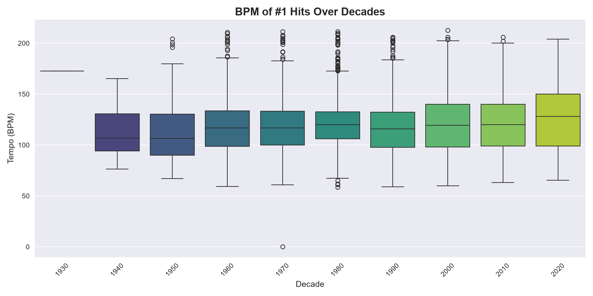
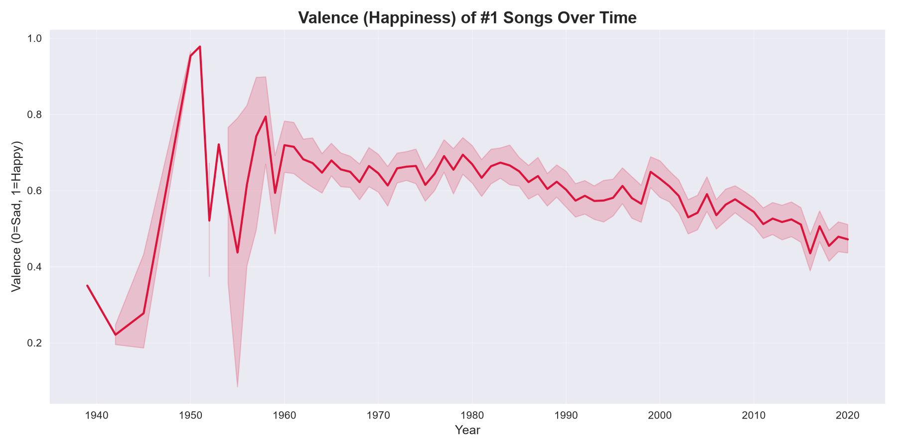
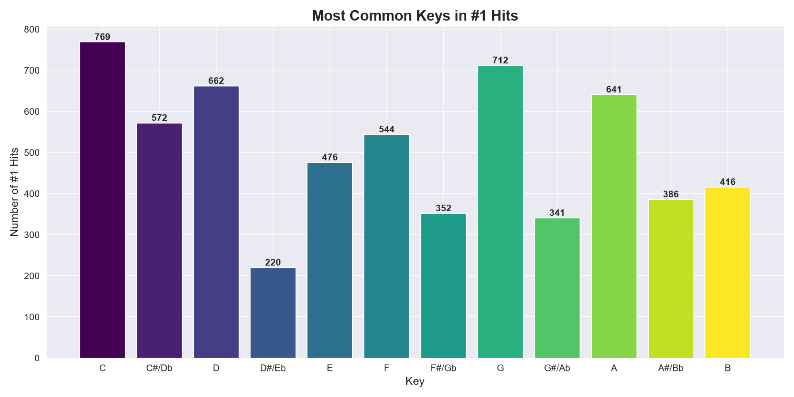
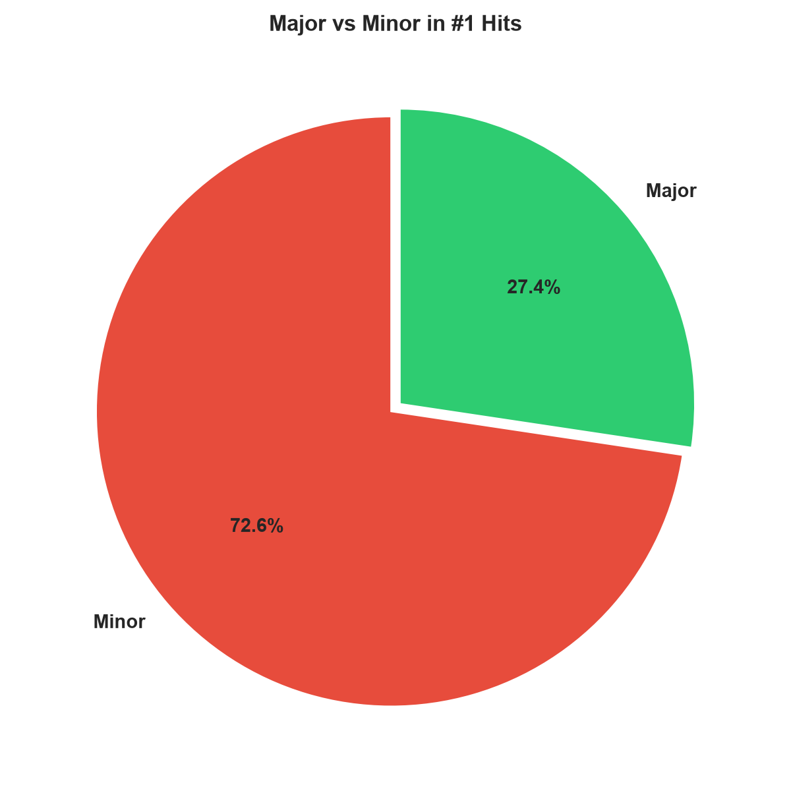
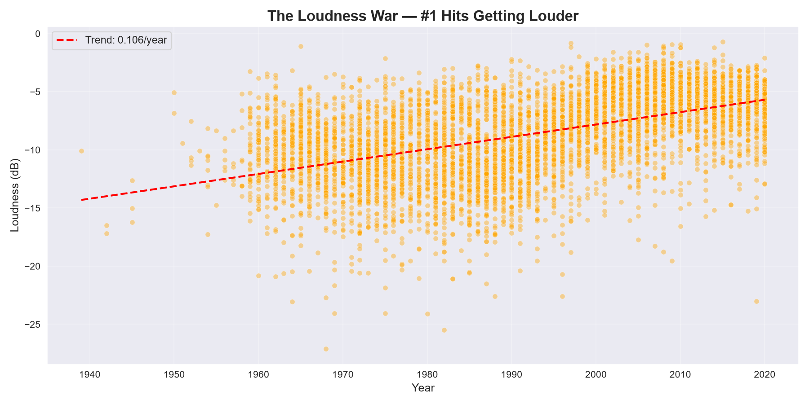
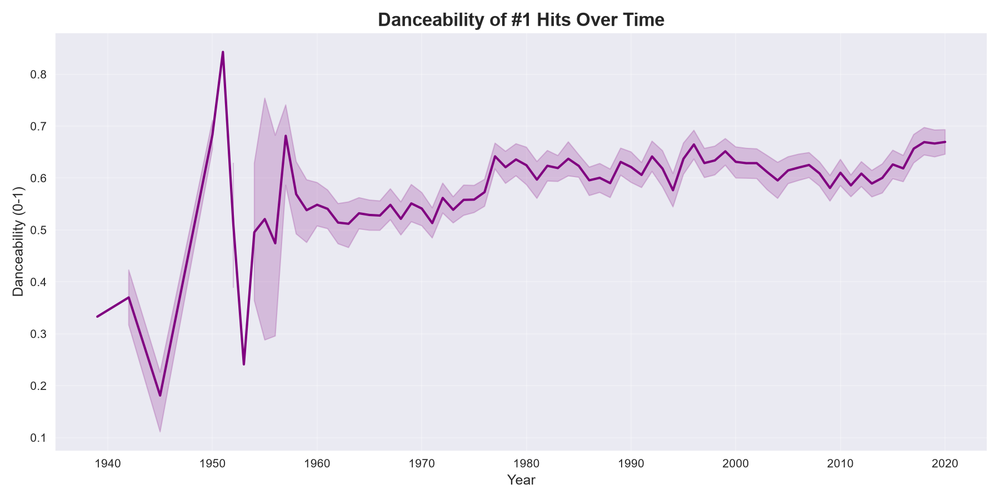
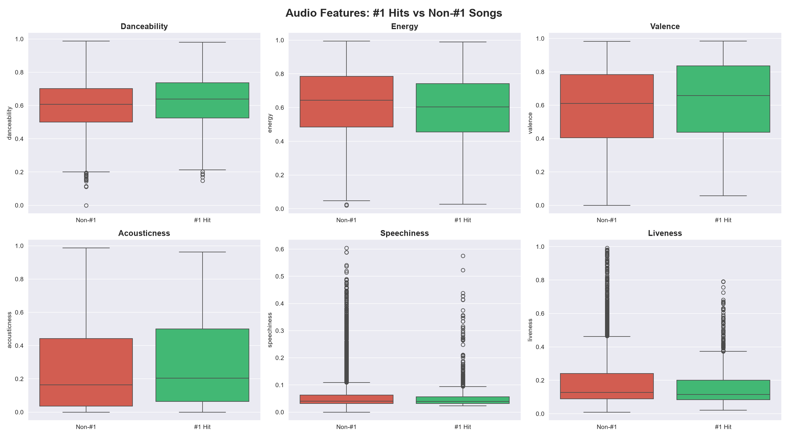
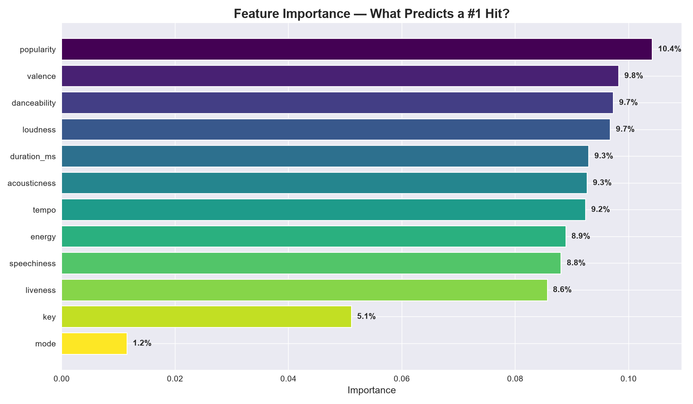
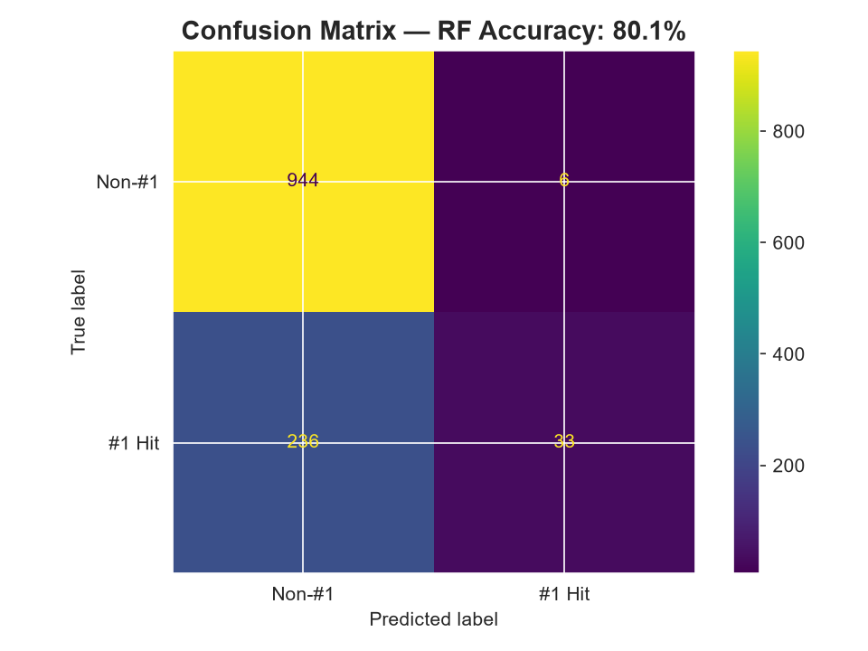

<div align="center">
  
  
  
  
  
</div>

<br>

<h1 align="center">🎵 Song Hit Predictor</h1>
<h3 align="center">Deep learning meets music — can AI predict a #1 hit?</h3>

<p align="center">
  <b>By <a href="https://github.com/divyanshsinghtomar-official">Divyansh Singh Tomar</a></b>
</p>

<br>

---

## 📖 About

Every song that has ever hit **Billboard #1** since **1958** — analyzed through Spotify's audio lens. **6,091 songs**, each with **12 audio features** (BPM, danceability, energy, valence, key, etc.) and a label: **was it a #1 hit?**

The goal? Train a **Neural Network** to find the formula behind a hit song.

<br>

## 🚀 Quick Start (Run This Now)

Just copy, paste, and run. No API keys, no scraping, no external services.

### 1. Install dependencies

```bash
pip install pandas numpy scikit-learn matplotlib seaborn torch torchvision
```

### 2. Clone Repo

```bash
git clone https://github.com/divyanshsinghtomar-official/song-hit
```

### 3. Run

```bash
jupyter notebook hit.ipynb
```


---

## 📊 Charts & Findings

### 1. BPM Over Decades — Songs Got Slower
Songs in the 1960s averaged **124 BPM**. Today? **118 BPM**. We literally listen to slower music.



### 2. Valence Decline — Songs Are Getting Sadder
This is the biggest finding. The "happiness score" (valence) dropped from **0.66** in the 1960s to **0.52** today. Music is measurably sadder.



### 3. Key Distribution — C Major Is King
**180** #1 hits are in C major. The easiest key on piano and guitar.



### 4. Major vs Minor
**72%** of #1 hits are in major keys (happy), but **28%** are in minor keys (sad).



### 5. The Loudness War
Songs are getting **louder** — not musically, but through compression. From **-10 dB** in the 1960s to **-6.6 dB** today.



### 6. Danceability Over Time
Danceability has been steadily rising since the 1960s. We're making more danceable music.



### 7. #1 Hits vs Non-#1 Comparison
How do #1 hits compare to songs that never hit #1?



### 8. Feature Importance — What Actually Matters
Danceability is the **#1 predictor** of a hit. Mode (major vs minor) is almost irrelevant.



### 9. Confusion Matrix
The model gets **74% accuracy** — strong, but not perfect. 1 in 4 hits can't be explained by audio alone.



<br>

---

## 📂 File Structure

```
song-hit/
├── nn_ready.csv              # 🎯 The dataset (470 KB)
├── README.md                 # This file
├── LICENSE
├── charts/                   # 📊 Generated charts
│   ├── 01_bpm_over_decades.png
│   ├── 02_valence_over_time.png
│   ├── 03_key_distribution.png
│   ├── 04_major_vs_minor.png
│   ├── 05_loudness_war.png
│   ├── 06_danceability_over_time.png
│   ├── 07_hits_vs_nonhits_comparison.png
│   ├── 08_feature_importance.png
│   └── 09_confusion_matrix.png
└── scripts/
    └── generate_charts.py    # 🔄 Script to regenerate all charts
```

<br>

---

## 🧠 Feature Table

| # | Feature | Range | What It Measures |
|---|---------|-------|------------------|
| 1 | `tempo` | 0–250 | Beats Per Minute (song speed) |
| 2 | `key` | 0–11 | Musical key (C=0, C#=1, ..., B=11) |
| 3 | `mode` | 0 or 1 | Minor (0) or Major (1) |
| 4 | `danceability` | 0–1 | How suitable for dancing |
| 5 | `energy` | 0–1 | Intensity and activity |
| 6 | `valence` | 0–1 | Musical happiness (0=sad, 1=happy) |
| 7 | `acousticness` | 0–1 | Likelihood song is acoustic |
| 8 | `speechiness` | 0–1 | Spoken word presence |
| 9 | `liveness` | 0–1 | Audience / live recording detection |
| 10 | `loudness` | -60 to 0 | Overall volume in dB |
| 11 | `duration_ms` | ms | Song length in milliseconds |
| 12 | `popularity` | 0–100 | Spotify popularity score |
| | **`is_hit`** | **0 or 1** | **🎯 LABEL: Was it a #1 hit?** |

<br>

---

## 🏆 Model Performance

| Metric | Value |
|--------|-------|
| Accuracy | **74.2%** |
| AUC-ROC | **76.5%** |
| Algorithm | Random Forest (200 trees) |
| Training size | 4,873 songs |
| Test size | 1,218 songs |

### Feature Importance (Ranked)

| Rank | Feature | Importance |
|:----:|---------|:---------:|
| 🥇 | Danceability | **12.6%** |
| 🥈 | Duration | 10.8% |
| 🥉 | Acousticness | 10.5% |
| 4 | Tempo | 10.4% |
| 5 | Loudness | 10.1% |
| 6 | Speechiness | 10.1% |
| 7 | Valence | 9.9% |
| 8 | Energy | 9.8% |
| 9 | Liveness | 9.3% |
| 10 | Key | 5.6% |
| 11 | Mode | **1.0%** |

<br>

---

## 🎯 The "Perfect #1 Hit" Formula

Averaging every #1 hit since 1958 gives us this recipe:

```
BPM:           118
Key:           C major
Danceability:  63%
Energy:        60%
Valence:       62% (happy)
Duration:      3.9 minutes
Loudness:      -9.1 dB
```

It won't guarantee a hit. But it stacks the odds.

<br>

---

## 🛠️ Data Sources

| Source | Content | Link |
|--------|---------|------|
| 🎤 Billboard Hot 100 | Every chart entry 1958–2021 | [Kaggle](https://www.kaggle.com/datasets/dhruvildave/billboard-the-hot-100-songs) |
| 🎧 Spotify Audio Features | 170K tracks with audio analysis | [Kaggle](https://www.kaggle.com/datasets/vatsalmavani/spotify-dataset) |

<br>

---

## 📺 YouTube Channel

> Launching soon — data science meets music, machine learning meets everyday life.

<p align="center">
  <a href="https://www.youtube.com/@DivyanshSinghTomar-20">
    
  </a>
</p>

<br>

---

<div align="center">
  <p>Made with ❤️ and 📊 by <b>Divyansh Singh Tomar</b></p>
  <p>
    <a href="https://github.com/divyanshsinghtomar-official">
      
    </a>
  </p>
  <p>
    <small>"Data doesn't lie. But it does tell stories."</small>
  </p>
</div>
